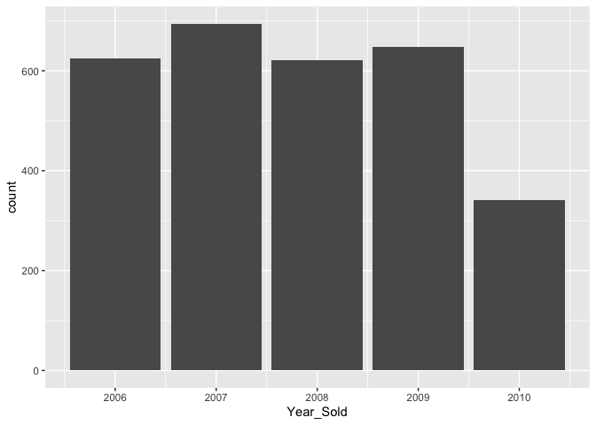
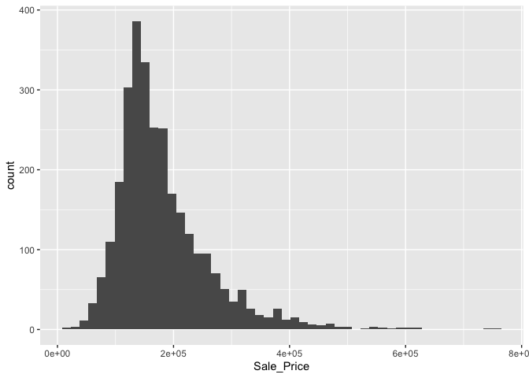
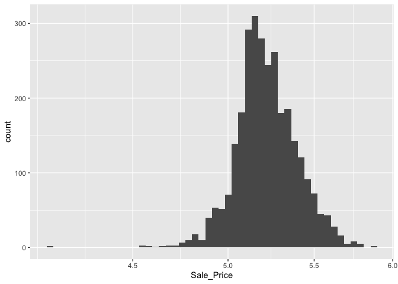

Hello Models: Ames Housing Data
================
[Jim Tyhurst, Ph.D.](https://www.jimtyhurst.com/)<br>
2021-09-23

-   [Introduction](#introduction)
-   [Exploring the data](#exploring-the-data)
-   [Splitting the data for training and
    testing](#splitting-the-data-for-training-and-testing)
-   [Fitting a model](#fitting-a-model)
-   [Source code](#source-code)
-   [References](#references)

## Introduction

The goal of this analysis is to produce a *predictive model* that
predicts the `Sale_Price` of a house, based on other features provided
in the data.

This analysis is built from sample code in Kuhn and Silge (2021) “[Tidy
Modeling with R](https://www.tmwr.org/ames.html)”. The
[tidymodels](https://www.tidymodels.org/) framework is a collection of
[packages](https://www.tidymodels.org/packages/) for modeling and
machine learning using [tidyverse](https://www.tidyverse.org/)
principles.

*Coding style*: Most people do not bother to show the package associated
with a function, but I find it easier to learn a new set of packages
when each function call is prefixed with the package to which it
belongs. For example, `rsample::initial_split`, rather than
`initial_split`.

## Exploring the data

First, we load the data:

``` r
library(tidyverse)
library(tidymodels)
library(glmnet)
library(modeldata)
data(ames)

dplyr::glimpse(ames)
#> Rows: 2,930
#> Columns: 74
#> $ MS_SubClass        <fct> One_Story_1946_and_Newer_All_Styles, One_Story_1946_and_Newer_All_Styles, On…
#> $ MS_Zoning          <fct> Residential_Low_Density, Residential_High_Density, Residential_Low_Density, …
#> $ Lot_Frontage       <dbl> 141, 80, 81, 93, 74, 78, 41, 43, 39, 60, 75, 0, 63, 85, 0, 47, 152, 88, 140,…
#> $ Lot_Area           <int> 31770, 11622, 14267, 11160, 13830, 9978, 4920, 5005, 5389, 7500, 10000, 7980…
#> $ Street             <fct> Pave, Pave, Pave, Pave, Pave, Pave, Pave, Pave, Pave, Pave, Pave, Pave, Pave…
#> $ Alley              <fct> No_Alley_Access, No_Alley_Access, No_Alley_Access, No_Alley_Access, No_Alley…
#> $ Lot_Shape          <fct> Slightly_Irregular, Regular, Slightly_Irregular, Regular, Slightly_Irregular…
#> $ Land_Contour       <fct> Lvl, Lvl, Lvl, Lvl, Lvl, Lvl, Lvl, HLS, Lvl, Lvl, Lvl, Lvl, Lvl, Lvl, Lvl, H…
#> $ Utilities          <fct> AllPub, AllPub, AllPub, AllPub, AllPub, AllPub, AllPub, AllPub, AllPub, AllP…
#> $ Lot_Config         <fct> Corner, Inside, Corner, Corner, Inside, Inside, Inside, Inside, Inside, Insi…
#> $ Land_Slope         <fct> Gtl, Gtl, Gtl, Gtl, Gtl, Gtl, Gtl, Gtl, Gtl, Gtl, Gtl, Gtl, Gtl, Gtl, Gtl, M…
#> $ Neighborhood       <fct> North_Ames, North_Ames, North_Ames, North_Ames, Gilbert, Gilbert, Stone_Broo…
#> $ Condition_1        <fct> Norm, Feedr, Norm, Norm, Norm, Norm, Norm, Norm, Norm, Norm, Norm, Norm, Nor…
#> $ Condition_2        <fct> Norm, Norm, Norm, Norm, Norm, Norm, Norm, Norm, Norm, Norm, Norm, Norm, Norm…
#> $ Bldg_Type          <fct> OneFam, OneFam, OneFam, OneFam, OneFam, OneFam, TwnhsE, TwnhsE, TwnhsE, OneF…
#> $ House_Style        <fct> One_Story, One_Story, One_Story, One_Story, Two_Story, Two_Story, One_Story,…
#> $ Overall_Cond       <fct> Average, Above_Average, Above_Average, Average, Average, Above_Average, Aver…
#> $ Year_Built         <int> 1960, 1961, 1958, 1968, 1997, 1998, 2001, 1992, 1995, 1999, 1993, 1992, 1998…
#> $ Year_Remod_Add     <int> 1960, 1961, 1958, 1968, 1998, 1998, 2001, 1992, 1996, 1999, 1994, 2007, 1998…
#> $ Roof_Style         <fct> Hip, Gable, Hip, Hip, Gable, Gable, Gable, Gable, Gable, Gable, Gable, Gable…
#> $ Roof_Matl          <fct> CompShg, CompShg, CompShg, CompShg, CompShg, CompShg, CompShg, CompShg, Comp…
#> $ Exterior_1st       <fct> BrkFace, VinylSd, Wd Sdng, BrkFace, VinylSd, VinylSd, CemntBd, HdBoard, Cemn…
#> $ Exterior_2nd       <fct> Plywood, VinylSd, Wd Sdng, BrkFace, VinylSd, VinylSd, CmentBd, HdBoard, Cmen…
#> $ Mas_Vnr_Type       <fct> Stone, None, BrkFace, None, None, BrkFace, None, None, None, None, None, Non…
#> $ Mas_Vnr_Area       <dbl> 112, 0, 108, 0, 0, 20, 0, 0, 0, 0, 0, 0, 0, 0, 0, 603, 0, 350, 0, 119, 480, …
#> $ Exter_Cond         <fct> Typical, Typical, Typical, Typical, Typical, Typical, Typical, Typical, Typi…
#> $ Foundation         <fct> CBlock, CBlock, CBlock, CBlock, PConc, PConc, PConc, PConc, PConc, PConc, PC…
#> $ Bsmt_Cond          <fct> Good, Typical, Typical, Typical, Typical, Typical, Typical, Typical, Typical…
#> $ Bsmt_Exposure      <fct> Gd, No, No, No, No, No, Mn, No, No, No, No, No, No, Gd, Av, Gd, Av, Av, No, …
#> $ BsmtFin_Type_1     <fct> BLQ, Rec, ALQ, ALQ, GLQ, GLQ, GLQ, ALQ, GLQ, Unf, Unf, ALQ, Unf, GLQ, GLQ, A…
#> $ BsmtFin_SF_1       <dbl> 2, 6, 1, 1, 3, 3, 3, 1, 3, 7, 7, 1, 7, 3, 3, 1, 3, 3, 4, 1, 2, 3, 3, 1, 3, 2…
#> $ BsmtFin_Type_2     <fct> Unf, LwQ, Unf, Unf, Unf, Unf, Unf, Unf, Unf, Unf, Unf, Unf, Unf, Unf, BLQ, U…
#> $ BsmtFin_SF_2       <dbl> 0, 144, 0, 0, 0, 0, 0, 0, 0, 0, 0, 0, 0, 0, 1120, 0, 0, 0, 0, 163, 0, 168, 0…
#> $ Bsmt_Unf_SF        <dbl> 441, 270, 406, 1045, 137, 324, 722, 1017, 415, 994, 763, 233, 789, 663, 0, 2…
#> $ Total_Bsmt_SF      <dbl> 1080, 882, 1329, 2110, 928, 926, 1338, 1280, 1595, 994, 763, 1168, 789, 1300…
#> $ Heating            <fct> GasA, GasA, GasA, GasA, GasA, GasA, GasA, GasA, GasA, GasA, GasA, GasA, GasA…
#> $ Heating_QC         <fct> Fair, Typical, Typical, Excellent, Good, Excellent, Excellent, Excellent, Ex…
#> $ Central_Air        <fct> Y, Y, Y, Y, Y, Y, Y, Y, Y, Y, Y, Y, Y, Y, Y, Y, Y, Y, Y, Y, Y, Y, Y, Y, Y, Y…
#> $ Electrical         <fct> SBrkr, SBrkr, SBrkr, SBrkr, SBrkr, SBrkr, SBrkr, SBrkr, SBrkr, SBrkr, SBrkr,…
#> $ First_Flr_SF       <int> 1656, 896, 1329, 2110, 928, 926, 1338, 1280, 1616, 1028, 763, 1187, 789, 134…
#> $ Second_Flr_SF      <int> 0, 0, 0, 0, 701, 678, 0, 0, 0, 776, 892, 0, 676, 0, 0, 1589, 672, 0, 0, 0, 0…
#> $ Gr_Liv_Area        <int> 1656, 896, 1329, 2110, 1629, 1604, 1338, 1280, 1616, 1804, 1655, 1187, 1465,…
#> $ Bsmt_Full_Bath     <dbl> 1, 0, 0, 1, 0, 0, 1, 0, 1, 0, 0, 1, 0, 1, 1, 1, 0, 1, 0, 1, 0, 1, 1, 1, 1, 1…
#> $ Bsmt_Half_Bath     <dbl> 0, 0, 0, 0, 0, 0, 0, 0, 0, 0, 0, 0, 0, 0, 0, 0, 0, 0, 0, 0, 0, 0, 0, 0, 0, 0…
#> $ Full_Bath          <int> 1, 1, 1, 2, 2, 2, 2, 2, 2, 2, 2, 2, 2, 1, 1, 3, 2, 1, 1, 2, 2, 2, 2, 1, 1, 1…
#> $ Half_Bath          <int> 0, 0, 1, 1, 1, 1, 0, 0, 0, 1, 1, 0, 1, 1, 1, 1, 0, 1, 0, 0, 0, 0, 1, 0, 1, 0…
#> $ Bedroom_AbvGr      <int> 3, 2, 3, 3, 3, 3, 2, 2, 2, 3, 3, 3, 3, 2, 1, 4, 4, 1, 2, 3, 3, 3, 3, 2, 3, 3…
#> $ Kitchen_AbvGr      <int> 1, 1, 1, 1, 1, 1, 1, 1, 1, 1, 1, 1, 1, 1, 1, 1, 1, 1, 1, 1, 1, 1, 1, 1, 1, 1…
#> $ TotRms_AbvGrd      <int> 7, 5, 6, 8, 6, 7, 6, 5, 5, 7, 7, 6, 7, 5, 4, 12, 8, 8, 4, 7, 7, 6, 7, 5, 6, …
#> $ Functional         <fct> Typ, Typ, Typ, Typ, Typ, Typ, Typ, Typ, Typ, Typ, Typ, Typ, Typ, Typ, Typ, M…
#> $ Fireplaces         <int> 2, 0, 0, 2, 1, 1, 0, 0, 1, 1, 1, 0, 1, 1, 0, 1, 0, 1, 0, 2, 1, 2, 0, 1, 1, 1…
#> $ Garage_Type        <fct> Attchd, Attchd, Attchd, Attchd, Attchd, Attchd, Attchd, Attchd, Attchd, Attc…
#> $ Garage_Finish      <fct> Fin, Unf, Unf, Fin, Fin, Fin, Fin, RFn, RFn, Fin, Fin, Fin, Fin, Unf, RFn, F…
#> $ Garage_Cars        <dbl> 2, 1, 1, 2, 2, 2, 2, 2, 2, 2, 2, 2, 2, 2, 2, 3, 2, 3, 2, 2, 2, 2, 2, 2, 2, 1…
#> $ Garage_Area        <dbl> 528, 730, 312, 522, 482, 470, 582, 506, 608, 442, 440, 420, 393, 506, 528, 8…
#> $ Garage_Cond        <fct> Typical, Typical, Typical, Typical, Typical, Typical, Typical, Typical, Typi…
#> $ Paved_Drive        <fct> Partial_Pavement, Paved, Paved, Paved, Paved, Paved, Paved, Paved, Paved, Pa…
#> $ Wood_Deck_SF       <int> 210, 140, 393, 0, 212, 360, 0, 0, 237, 140, 157, 483, 0, 192, 0, 503, 325, 1…
#> $ Open_Porch_SF      <int> 62, 0, 36, 0, 34, 36, 0, 82, 152, 60, 84, 21, 75, 0, 54, 36, 12, 0, 0, 0, 12…
#> $ Enclosed_Porch     <int> 0, 0, 0, 0, 0, 0, 170, 0, 0, 0, 0, 0, 0, 0, 0, 0, 0, 0, 0, 0, 0, 0, 0, 0, 0,…
#> $ Three_season_porch <int> 0, 0, 0, 0, 0, 0, 0, 0, 0, 0, 0, 0, 0, 0, 0, 0, 0, 0, 0, 0, 0, 0, 0, 0, 0, 0…
#> $ Screen_Porch       <int> 0, 120, 0, 0, 0, 0, 0, 144, 0, 0, 0, 0, 0, 0, 140, 210, 0, 0, 0, 0, 0, 0, 0,…
#> $ Pool_Area          <int> 0, 0, 0, 0, 0, 0, 0, 0, 0, 0, 0, 0, 0, 0, 0, 0, 0, 0, 0, 0, 0, 0, 0, 0, 0, 0…
#> $ Pool_QC            <fct> No_Pool, No_Pool, No_Pool, No_Pool, No_Pool, No_Pool, No_Pool, No_Pool, No_P…
#> $ Fence              <fct> No_Fence, Minimum_Privacy, No_Fence, No_Fence, Minimum_Privacy, No_Fence, No…
#> $ Misc_Feature       <fct> None, None, Gar2, None, None, None, None, None, None, None, None, Shed, None…
#> $ Misc_Val           <int> 0, 0, 12500, 0, 0, 0, 0, 0, 0, 0, 0, 500, 0, 0, 0, 0, 0, 0, 0, 0, 0, 0, 0, 7…
#> $ Mo_Sold            <int> 5, 6, 6, 4, 3, 6, 4, 1, 3, 6, 4, 3, 5, 2, 6, 6, 6, 6, 6, 2, 1, 1, 1, 3, 4, 7…
#> $ Year_Sold          <int> 2010, 2010, 2010, 2010, 2010, 2010, 2010, 2010, 2010, 2010, 2010, 2010, 2010…
#> $ Sale_Type          <fct> WD , WD , WD , WD , WD , WD , WD , WD , WD , WD , WD , WD , WD , WD , WD , W…
#> $ Sale_Condition     <fct> Normal, Normal, Normal, Normal, Normal, Normal, Normal, Normal, Normal, Norm…
#> $ Sale_Price         <int> 215000, 105000, 172000, 244000, 189900, 195500, 213500, 191500, 236500, 1890…
#> $ Longitude          <dbl> -93.61975, -93.61976, -93.61939, -93.61732, -93.63893, -93.63893, -93.63379,…
#> $ Latitude           <dbl> 42.05403, 42.05301, 42.05266, 42.05125, 42.06090, 42.06078, 42.06298, 42.060…
```

This data covers five years from 2006 to 2010:

``` r
ggplot(ames, aes(x = Year_Sold)) + 
  geom_bar()
```

<!-- -->

We want to predict the `Sale_Price`:

``` r
ggplot(ames, aes(x = Sale_Price)) + 
  geom_histogram(bins = 50)
```

<!-- -->

We will use the `log` of the `Sales_Price`, so that errors in predicting
expensive houses will not have an excessive influence on the model.

``` r
ames_log <- ames %>% mutate(Sale_Price = log10(Sale_Price))
ggplot(ames_log, aes(x = Sale_Price)) + 
  geom_histogram(bins = 50) +
  scale_x_log10()
```

<!-- -->

## Splitting the data for training and testing

Split the data into 80% for training and 20% for testing. A stratified
random sample will conduct the 80/20 split within each quartile of the
data and then pool the results together. This makes it more likely to
get a good split of training and test cases, even for the smaller number
of very high-priced homes. In
{[rsample](https://rsample.tidymodels.org/)}, this is achieved using the
`strata` argument with the name of a column:

``` r
# Initialize the random number stream, so that the results can be reproduced later. 
set.seed(123)

# Save the split information for an 80/20 split of the data
ames_split <- rsample::initial_split(ames_log, prop = 0.80, strata = Sale_Price)
ames_split
#> <Analysis/Assess/Total>
#> <2342/588/2930>
```

## Fitting a model

We will use the [glmnet](https://cran.r-project.org/package=glmnet)
package to build a linear regression model based on the `Longitude` and
`Latitude` of the house. The
{[parsnip](https://parsnip.tidymodels.org/)} package provides functions
for configuring and fitting a model.

``` r
ames_training_data <- rsample::training(ames_split) |> select(Longitude, Latitude, Sale_Price)
ames_testing_data <- rsample::testing(ames_split) |> select(Longitude, Latitude, Sale_Price)

glm_fit <- parsnip::linear_reg(penalty = 1) %>%
  parsnip::set_engine("glmnet") %>%
  parsnip::fit_xy(
    x = ames_training_data %>% select(Longitude, Latitude),
    y = ames_training_data %>% pull(Sale_Price)
  )
```

Use the `glm_fit` model to make predictions on the test dataset:

``` r
glm_predictions <- predict(glm_fit, new_data = ames_testing_data)
glm_predictions
#> # A tibble: 588 x 1
#>    .pred
#>    <dbl>
#>  1  5.22
#>  2  5.22
#>  3  5.22
#>  4  5.22
#>  5  5.22
#>  6  5.22
#>  7  5.22
#>  8  5.22
#>  9  5.22
#> 10  5.22
#> # … with 578 more rows
```

<span style="color:red">**TODO**</span>: Something is wrong … <span
style="color:red">All of the predicted values are the same value!</span>

``` r
min(glm_predictions$.pred)
#> [1] 5.218803
```

``` r
max(glm_predictions$.pred)
#> [1] 5.218803
```

## Source code

[Ames-Housing-Data.Rmd](./Ames-Housing-Data.Rmd)

## References

[Tidymodels](https://www.tidymodels.org/).

[Tidyverse](https://www.tidyverse.org/).

Max Kuhn and Julia Silge. 2021-09-08. [Tidy Modeling with
R](https://www.tmwr.org/). Free, online book.
